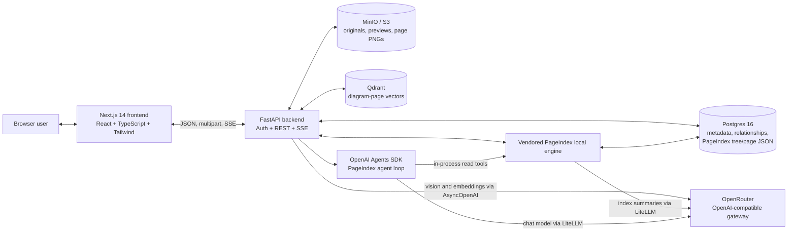
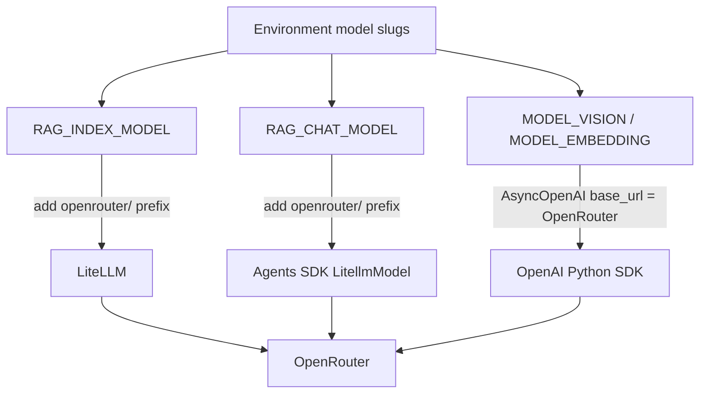
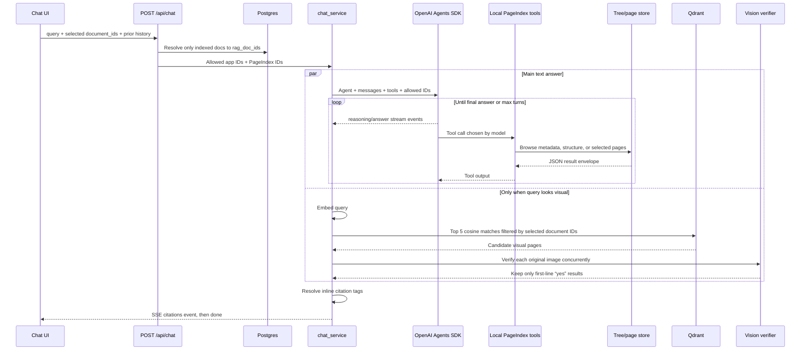

# RAG Engine: Architecture and End-to-End Flow

> Source-verified technical guide for explaining the system to the team.  
> Last audited against this repository: **2026-09-23**.  
> Runtime truth is the code plus the active environment; model names and operational behavior can change when configuration or dependencies change.

                 GPT-5-mini
                     │
                     │ chooses
                     ↓
            OpenAI Agents SDK
                     │
       ┌─────────────┼──────────────┐
       │             │              │
       ↓             ↓              ↓
browse_documents  structure     page_content
       │             │              │
       └─────────────┼──────────────┘
                     ↓
                RAG Engine
                     ↓
       ┌─────────────┼─────────────┐
       ↓             ↓             ↓
    doc.json      tree.json     pages.json

## 1. Executive summary

This application is a local-first, document-question-answering system with two retrieval paths:

1. **Tree/page retrieval for normal document text.** Files are normalized to PDF, converted into page text and a hierarchical PageIndex tree, and read at query time by an agent through tools such as `get_document_structure` and `get_page_content`.
2. **Vector plus vision retrieval for scanned/visual PDF pages.** Scanned pages are described and OCRed by a vision model, their text descriptions are embedded into Qdrant, and visual-looking questions run semantic vector search followed by vision verification against the original page image.

The most important architectural fact is:

> **Ordinary document text is not embedded into Qdrant. Qdrant currently stores one vector per scanned/visual PDF page only.** Text answers are produced by an agent that navigates a document tree and reads selected pages.

The browser talks to a FastAPI backend. FastAPI stores metadata in Postgres, files and rendered previews in MinIO/S3, visual-page vectors in Qdrant, and PageIndex tree/page artifacts in a Postgres table (`document_trees`). The chat agent is built with the OpenAI Agents SDK, but its configured model is routed through LiteLLM and OpenRouter. Direct vision and embedding requests use the OpenAI Python client pointed at OpenRouter's OpenAI-compatible endpoint.

## 2. A 90-second explanation for teammates

Use this summary in a meeting:

> A user uploads a supported document to FastAPI. We hash it for deduplication, store the original in MinIO/S3, create a Postgres record, and start ingestion in a FastAPI background task. The local PageIndex engine only accepts text-readable PDFs, so non-PDF files are parsed into semantic blocks and rendered as PDF first. A normal PDF goes straight to PageIndex. A scanned PDF is rasterized page by page, sent to a vision model for OCR and descriptions, and rebuilt as a text PDF before PageIndex sees it.
>
> PageIndex builds a hierarchy of headings and page ranges, adds LLM summaries and a document description, and stores the tree plus full page text as a row in Postgres (`document_trees`). This is the main text-retrieval index; it is not a vector index. For scanned pages, we additionally embed the vision caption, description, and OCR text, then store one cosine vector per page in Qdrant.
>
> During chat, the frontend sends the question, selected document IDs, and prior visible messages. The backend starts one PageIndex agent over the allowed documents. The OpenAI Agents SDK sends the model its instructions and four read-only tools. The model can browse documents, inspect structure, read targeted pages, and repeat until it has enough evidence. Answer tokens and tool activity stream to the browser over SSE. The model writes citation tags, the backend resolves them to document/page records, and clicking a citation opens a presigned PDF preview at that page. If the query sounds visual, a parallel path embeds the question, searches Qdrant, and asks the vision model to verify each candidate page before showing it.

## 3. System architecture



### 3.1 Containers and ports

| Service | Technology | Host port | Persistent data |
|---|---|---:|---|
| `frontend` | Node 20, Next.js dev server | `3000` | Browser `localStorage`; source bind mount in dev |
| `backend` | Python 3.12, Uvicorn, FastAPI | `8000` | Stateless; tree/page JSON lives in Postgres (`document_trees`) |
| `postgres` | Postgres 16 | `5432` | `pgdata` |
| `qdrant` | Qdrant | `6333` | `qdrant-data` |
| `minio` | MinIO, S3-compatible object storage | `9000`; console `9001` | `minio-data` |

The definitions are in [`docker-compose.dev.yml`](../docker-compose.dev.yml). The backend creates the configured S3 bucket during FastAPI startup, but database migrations are run separately by [`scripts/dev-start.sh`](../scripts/dev-start.sh).

## 4. Technology stack

### 4.1 Frontend

| Layer | Technology | Role |
|---|---|---|
| Framework | Next.js 14 App Router | Browser application and component build |
| UI | React 18 + TypeScript | State, chat, upload, folders, preview |
| Styling | Tailwind CSS + `clsx` | Theme tokens, responsive layout, conditional styles |
| Icons | `lucide-react` | Interface icons |
| PDF viewer | `react-pdf` / PDF.js | In-browser rendered PDF preview and page navigation |
| Speech | Browser Web Speech APIs | Speech recognition and text-to-speech; no backend call |
| Persistence | `localStorage` | JWT, chat sessions, theme, active session, preview width |

The PDF.js worker is currently loaded from `unpkg.com` at runtime in [`PdfPreview.tsx`](../frontend/src/components/preview/PdfPreview.tsx). PDF previews therefore have an external runtime dependency unless that worker is self-hosted.

### 4.2 Backend and data

| Layer | Technology | Role |
|---|---|---|
| Web/API | FastAPI + Uvicorn | REST endpoints, upload handling, SSE streaming |
| Validation | Pydantic v2 + pydantic-settings | API schemas and environment configuration |
| Relational DB | SQLAlchemy 2 async + `asyncpg` + Alembic | Document, diagram, folder, and membership records |
| Object storage | `boto3` | MinIO in development, S3-compatible storage in production |
| Vector DB | `qdrant-client` | Cosine search over diagram-page embeddings |
| Agent orchestration | `openai-agents` | Agent, runner, tools, tool loop, streaming events |
| Model routing | LiteLLM | PageIndex index/chat calls through OpenRouter |
| Direct model client | `openai.AsyncOpenAI` | Vision Chat Completions and embeddings through OpenRouter |
| Tree indexing | Vendored PageIndex local engine | PDF layout tree, summaries, local page/tool retrieval |
| PDF parsing | PyPDF2, `pypdf`, PDFium, PyMuPDF | Text extraction, layout analysis, classification, rasterization |
| File parsing | `python-docx`, `openpyxl`, stdlib CSV/email/JSON | Normalize supported source types |
| PDF generation | ReportLab | Render normalized blocks and OCR pages into PDFs |
| Auth | PyJWT | Single-admin HS256 bearer tokens |

### 4.3 Runtime source of truth

The tree-indexing/tree-search engine lives entirely in [`backend/app/rag_core`](../backend/app/rag_core) -- a vendored, renamed copy of the local-mode-relevant PageIndex engine source, kept under this project's own naming rather than as a pip dependency (see `docs/PROMPTS.md` for why, and for a full accounting of what's vendored verbatim vs. reachable vs. dead code). The original reference tree this was copied from (an untracked, un-renamed local checkout, previously kept at the repo root for diffing) has been deleted now that file-for-file parity was verified; `backend/app/rag_core` is the sole and authoritative copy.

## 5. Configuration and model routing

All settings are declared in [`backend/app/core/config.py`](../backend/app/core/config.py). The five model fields have no Python defaults, so the backend refuses to start if any is absent.

The current example configuration is:

| Environment variable | Current example value | Purpose |
|---|---|---|
| `RAG_INDEX_MODEL` | `openai/gpt-4o-mini` | Tree expansion, node summaries, document description |
| `RAG_CHAT_MODEL` | `openai/gpt-5-mini` | Agent reasoning and final answer |
| `MODEL_VISION` | `qwen/qwen3-vl-235b-a22b-instruct` | Page OCR/description and query-time visual verification |
| `MODEL_EMBEDDING` | `openai/text-embedding-3-small` | Diagram description and query vectors |
| `MODEL_EMBEDDING_DIMENSION` | `1536` | Qdrant vector size; must match the embedding output |

Always confirm the active deployment environment. At audit time, [`docs/MODELS.md`](MODELS.md) and [`docs/PROMPTS.md`](PROMPTS.md) still described `RAG_CHAT_MODEL` as `openai/gpt-4o-mini`, while `.env.dev` and `.env.dev.example` use `openai/gpt-5-mini`.

### 5.1 Three model-call routes



- `RAG_INDEX_MODEL` and `RAG_CHAT_MODEL` are prefixed with `openrouter/` in [`rag_service.py`](../backend/app/rag_service.py). For example, `openai/gpt-5-mini` becomes `openrouter/openai/gpt-5-mini` for LiteLLM.
- Index-time PageIndex LLM calls use LiteLLM directly.
- Chat uses an OpenAI Agents SDK `LitellmModel`, which internally uses LiteLLM.
- Vision and embedding code creates `AsyncOpenAI(base_url=OPENROUTER_BASE_URL, api_key=OPENROUTER_API_KEY)` and calls OpenAI-compatible endpoints on OpenRouter.
- This system is not using OpenAI-hosted file search or OpenAI Vector Stores.

### 5.2 External model-call inventory

| Operation | Code/API surface | Trigger | Input | Output/use |
|---|---|---|---|---|
| Visual-page analysis | `AsyncOpenAI.chat.completions.create(...)` | Once per page of a scanned/drawing-heavy PDF | Vision prompt plus base64 PNG data URI | OCR text, caption, description, figure ID, callouts |
| Diagram-page embedding | `AsyncOpenAI.embeddings.create(...)` | Once per scanned/visual page | Caption + description + OCR text | Float vector stored in Qdrant |
| Query embedding | `AsyncOpenAI.embeddings.create(...)` | Once for a visual-looking question | User query text | Float vector used for Qdrant search |
| Visual candidate verification | `AsyncOpenAI.chat.completions.create(...)` | Once for each of up to five Qdrant candidates | User query plus original base64 page PNG | Yes/no verdict and explanation |
| Tree enrichment | LiteLLM completion helpers | During flash indexing | Node pages, child summaries, or whole tree | Expanded hierarchy, node summaries, document description |
| Agent turn | Agents SDK `LitellmModel` via `Runner.run_streamed(...)` | One or more times per chat request | Instructions, history, tool schemas, tool outputs | Tool calls, reasoning deltas, final cited answer |

The `openai` client calls are SDK method calls against the configured OpenRouter base URL, not direct requests to `api.openai.com`. Similarly, the Agents SDK manages the tool loop, but LiteLLM/OpenRouter supplies the actual configured chat model.

## 6. Data ownership and identifiers

### 6.1 Identifier map

| Identifier | Example/shape | Owner | Meaning |
|---|---|---|---|
| `document_id` | Postgres UUID | Application | Main public document ID used by REST and frontend |
| `rag_doc_id` | `pi-<32 hex chars>` | PageIndex local engine | Pointer to the tree/page row in `document_trees` |
| `qdrant_point_id` | UUID | Diagram pipeline | Vector point for one scanned PDF page |
| `folder_id` | Postgres UUID | Application | A flat folder/label ID |
| Object key | `originals/...`, `previews/...`, `diagrams/...` | MinIO/S3 | Location of a stored binary |
| Agent `call_id` | Provider/SDK generated string | Agents SDK | Correlates a streamed tool call with its result |

Do not interchange `document_id` and `rag_doc_id`. The former is used for Postgres, Qdrant filters, object keys, and browser APIs. The latter is used only inside the PageIndex local library.

### 6.2 Storage responsibility matrix

| Store | Holds | Does not hold |
|---|---|---|
| Postgres (application tables) | Document metadata/status/hash; `rag_doc_id`; diagram OCR/caption/description; Qdrant point pointer; flat folders and memberships | Vector values, binary files, chat history |
| Postgres (`document_trees` table) | PageIndex `doc.json`/`tree.json`/`pages.json` equivalent, one row per document keyed by `rag_doc_id` | Original binary, diagram vectors |
| MinIO/S3 | Original upload; rendered non-PDF preview; scanned-page PNGs | Search tree, relational metadata, chat sessions |
| Qdrant | One vector and payload per scanned/visual page | Ordinary text-page or tree-node embeddings |
| Browser `localStorage` | Auth token, up to 50 chat sessions, selected document IDs, theme, preview width | Server-authoritative documents or indexes |

### 6.3 Postgres tables

- `documents`: one row per unique file hash. Status values are intended to be `queued`, `extracting`, `ocr`, `indexing`, `indexed`, or `failed`.
- `diagram_pages`: one row per page of a scanned/drawing-heavy PDF, including OCR and the Qdrant point ID.
- `folders`: flat named groups. There is no parent/child folder hierarchy.
- `document_folders`: many-to-many join table. Folders behave like labels: a document can belong to zero, one, or many folders.
- `document_trees`: one row per document, keyed by `rag_doc_id` (not `document_id`). Holds the PageIndex engine's own `meta`/`tree`/`pages` JSON (see §11.4). Written and read only through `rag_core/postgres_store.py`'s `PostgresDocStore`, never joined against directly by application queries.

## 7. Upload-to-index flow

### 7.1 Sequence

```mermaid
sequenceDiagram
    participant B as Browser
    participant API as FastAPI
    participant PG as Postgres
    participant S3 as MinIO/S3
    participant ING as Background ingestion
    participant VIS as Vision/embedding APIs
    participant PI as PageIndex local engine
    participant Q as Qdrant

    B->>API: POST /api/documents (multipart file, optional folder_id)
    API->>API: Validate extension and SHA-256 hash
    API->>PG: Look for existing content_hash
    alt Duplicate content
        API->>PG: Optionally add existing document to folder
        API-->>B: Existing document_id and current status
    else New content
        API->>S3: Store originals/{uuid}/{filename}
        API->>PG: Insert queued document and folder membership
        API-->>B: document_id, status=queued
        API->>ING: FastAPI BackgroundTask
        ING->>PG: status=extracting
        ING->>S3: Read original bytes
        alt Text-layer PDF
            ING->>PI: submit PDF in flash mode
        else Scanned/drawing-heavy PDF
            ING->>VIS: OCR/caption/describe each page
            ING->>S3: Store diagrams/{document_id}/page-N.png
            ING->>VIS: Embed caption + description + OCR
            ING->>Q: Upsert one vector per page
            ING->>PI: Submit synthetic OCR PDF in flash mode
        else DOCX/CSV/XLSX/EML/TXT/JSON/XER
            ING->>ING: Parse semantic blocks and render a PDF
            ING->>S3: Store previews/{document_id}/rendered.pdf
            ING->>PI: Submit rendered PDF in flash mode
        end
        PI->>VIS: Index-model calls for expansion/summaries/description
        PI->>PG: Upsert document_trees row (meta, tree, pages)
        ING->>PG: Save rag_doc_id; status=indexed
        ING-->>B: SSE terminal event with tree
    end
```

### 7.2 Upload endpoint behavior

[`POST /api/documents`](../backend/app/api/documents.py) accepts `multipart/form-data`:

- `file`: required.
- `folder_id`: optional UUID.
- Allowed extensions: `pdf`, `docx`, `csv`, `xlsx`, `eml`, `txt`, `json`, `xer`.

The complete request body is read into memory and hashed with SHA-256. `documents.content_hash` is unique across the whole application.

Deduplication consequences:

- Re-uploading identical bytes returns the existing document instead of creating or re-indexing another one.
- If a `folder_id` is supplied, the existing document is additionally assigned to that folder.
- The original filename and binary remain those of the first upload.
- The frontend subscribes to progress after every upload response; the progress endpoint handles already-completed duplicate documents by immediately returning their terminal status.

For a new file, the original object key is `originals/{random_uuid}/{original_filename}`. The Postgres row is committed before ingestion is scheduled.

### 7.3 Background execution model

Ingestion uses FastAPI/Starlette `BackgroundTasks`, not Celery, Redis, a database job queue, or a separate worker service. This is simple, but it means:

- jobs live in the backend process;
- a backend restart can interrupt an ingest and leave a row in a nonterminal state;
- there is no retry policy, lease, dead-letter queue, or job recovery;
- CPU/memory/model-call load shares the API container;
- development runs one Uvicorn worker, matching the in-memory progress design.

Blocking parser and PageIndex operations are moved to threads with `asyncio.to_thread` so they do not block FastAPI's event loop.

## 8. Source-format normalization

The PageIndex local API accepts only PDFs with readable text. All other sources become a PDF before indexing.

| Input | Extraction behavior | Normalized result |
|---|---|---|
| Text PDF | Sample the first five pages for text density | Original PDF is indexed directly |
| Scanned/drawing PDF | Rasterize every page at 200 DPI; vision OCR and describe | Synthetic PDF with one hard page break per source page |
| DOCX | Walk low-level body elements to preserve paragraph/table interleaving; detect common heading styles | Headings, paragraphs, and grid tables rendered with ReportLab |
| CSV | UTF-8 with replacement; sniff comma, semicolon, tab, or pipe; ignore empty rows | Filename heading plus one grid table |
| XLSX | Read-only and `data_only=True`; each nonempty sheet in workbook order | Sheet heading plus table; formulas become last computed values |
| EML | Selected headers, plain/HTML body, attachment metadata | Header/body/attachment tables; attachment contents are not extracted |
| TXT | Split on blank lines | Filename heading plus paragraphs |
| JSON | Parse and pretty-print; fall back to raw text if invalid | Filename heading plus preformatted code block |
| XER | Parse `%T`, `%F`, `%R`, `%E` tabular sections | One heading and grid table per Primavera table |

The rendered PDF stored under `previews/{document_id}/rendered.pdf` is the artifact that PageIndex actually read. The preview endpoint returns this normalized PDF for every non-PDF format. This preserves semantic content, not necessarily the source file's original visual layout.

ReportLab rendering includes table pagination and an Arabic-capable Noto Sans font. For OCR PDFs, explicit page breaks preserve the source mapping: source page 7 remains synthetic page 7, which is essential for citations.

## 9. PDF classification and visual-page ingestion

### 9.1 Classification

[`pdf_ingest.py`](../backend/app/ingestion/pdf_ingest.py) extracts text from up to the first five pages with `pypdf`. A PDF is considered text-readable when the average stripped text length is at least 40 characters per sampled page. Anything below that threshold takes the scanned/drawing pipeline.

This is a document-level decision. A mostly textual PDF with a few diagram pages stays on the text path, so those diagrams are not added to Qdrant. Conversely, a document classified as scanned sends every page through vision, even if some pages are plain scanned text.

### 9.2 Vision analysis

[`diagram_pipeline.py`](../backend/app/ingestion/diagram_pipeline.py) does the following:

1. Opens the PDF with PyMuPDF.
2. Rasterizes every page to PNG at 200 DPI.
3. Runs at most four vision requests concurrently.
4. Sends each page as a base64 data URI with a prompt requesting strict JSON:
   - `ocr_text`
   - `caption`
   - `description`
   - `figure_id`
   - `callouts`
5. If JSON parsing fails, the raw model response is retained as OCR text and the structured fields are left empty.
6. Stores the page PNG in object storage.
7. Creates a `diagram_pages` row.
8. Embeds `caption + description + ocr_text` as text.
9. Upserts one Qdrant point per page.

The raw image is **not** embedded. It is kept in object storage and later used for vision verification.

### 9.3 Diagram Qdrant point

The collection name is derived from the model, for example:

```text
diagram_pages__openai-text-embedding-3-small
```

The collection uses cosine distance and `MODEL_EMBEDDING_DIMENSION`. Its payload contains:

```json
{
  "document_id": "application UUID",
  "page_number": 12,
  "figure_id": "A-512",
  "caption": "...",
  "description": "...",
  "storage_key": "diagrams/<document_id>/page-12.png",
  "embedding_model": "openai/text-embedding-3-small"
}
```

OCR text contributes to the vector but is stored in Postgres rather than copied into the Qdrant payload. A model change selects a differently named collection, preventing vectors from different models from being mixed; existing pages are not automatically re-embedded into the new collection.

## 10. What “chunking” means in this codebase

“Chunk” refers to four different units. Keeping them separate prevents incorrect explanations.

| Unit | Created when | Stored where | Embedded? | Used for |
|---|---|---|---|---|
| Source block | Parsing non-PDF formats | Temporary Python list | No | PDF rendering (`heading`, `paragraph`, `table`, `code`) |
| Page chunk | PDF text extraction | `document_trees.pages` (jsonb) as `{page_index, markdown}` | No | `get_page_content` and citations |
| Tree node | PageIndex hierarchy over page ranges | `document_trees.tree` (jsonb) | No | Agent routing via titles and summaries |
| Diagram page | Scanned PDF vision processing | Postgres + object storage + Qdrant | Yes, one text vector per page | Visual semantic search and verification |

### 10.1 Page chunks

After tree construction, the local API extracts every PDF page with PyPDF2 and saves the full text as the `pages` column of that document's `document_trees` row. These are page-aligned chunks, not token-window chunks. A page can be very short or very long.

### 10.2 Node chunks

A tree node stores `start_index` and `end_index`. Node text is not separately persisted. When node-form OCR or a tree-with-text is requested, `add_node_text` reconstructs each node by joining the pages covered by that node.

Consequences:

- parent and child node text can overlap;
- “node chunks” in `/raw` are a generated view, not an independent chunk table;
- the agent normally uses node titles/summaries to choose pages and then reads page chunks;
- changing a tree span changes the generated node text without changing the stored `pages` column.

### 10.3 There is no fixed-size text embedding pipeline

There is no recursive character splitter, fixed token window, overlap parameter, or vector per paragraph for ordinary document text. The retrieval design is page-aligned and hierarchical. If the team later adds general semantic text retrieval, it will be a new third retrieval path and will need its own chunk schema, embedding lifecycle, collection, filters, and re-index strategy.

## 11. PageIndex tree construction

### 11.1 Flash mode is the active path

Every application caller submits with `mode="flash"`. Standard/classic and markdown implementations exist in the vendored tree but are not reached by this application.

Flash mode combines deterministic PDF layout analysis with targeted LLM enrichment:

1. PDFium extracts character spans and geometry.
2. The pipeline derives lines, page/document statistics, columns, and reading order.
3. It classifies headers, footers, watermarks, body text, captions, tables, and heading candidates.
4. Embedded PDF bookmarks are accepted, repaired, merged, or ignored based on quality.
5. It assembles a hierarchy with 1-based page ranges.
6. A deterministic optimization pass can merge nodes.
7. Nodes spanning more than five pages can trigger an LLM expansion call to propose real printed subsection headings.
8. Leaf and parent summaries are generated.
9. A one-sentence document description is generated.
10. Stable depth-first node IDs are written.

Tree extraction itself is primarily layout/statistics based; it is not “an LLM reads the whole PDF and invents a table of contents.” LLM calls enrich the structure after extraction.

### 11.2 Summary call behavior

- A leaf with under about 200 GPT-4o tokens reuses its raw text as its summary, avoiding a model call.
- Larger leaves receive one summary call.
- Parent nodes receive a call based on their intro text and child titles/summaries.
- Summary calls can run with concurrency 64.
- Each document receives one additional description call.
- Oversized collapsed nodes can receive expansion calls before summarization.

The indexing-call count therefore depends on the extracted tree; it is not one call per document.

### 11.3 Rejection cases

- A PDF with no readable text is rejected by PageIndex; the application prevents this by vision-OCRing scanned PDFs first.
- If no hierarchy is detected, flash mode falls back to one node per page.
- A flat fallback with more than 10 page nodes is rejected rather than accepted as an expensive low-quality index.
- PageIndex uses PDFium for the tree and PyPDF2 for stored page text. The local API verifies that tree page ranges stay inside PyPDF2's page count to catch parser disagreement.

### 11.4 Storage: the `document_trees` table

PageIndex's own knowledge structure is persisted as one row per document in Postgres, not as loose files on disk. The vendored engine's `DocStore` interface (`rag_core/local_store.py`) is implemented by `rag_core/postgres_store.py`'s `PostgresDocStore`, which is what `local_api.py` actually uses; `local_store.py`'s original file-based `DocStore` is left in the codebase unused, kept only so the swap is a one-line revert if ever needed.

| Column | Contents |
|---|---|
| `doc_id` (primary key) | The engine's own id, `pi-<hash>` — same value as `documents.rag_doc_id` |
| `meta` (jsonb) | name, description, status, page count, mode |
| `tree` (jsonb) | hierarchy, page ranges, node IDs, summaries; no full text |
| `pages` (jsonb) | one full text entry per 1-based page |

This is not a cache. Losing this table leaves valid `documents` rows whose `rag_doc_id` points to missing content — the same failure mode the old `rag-data` volume had, just on a store that now gets backed up alongside the rest of Postgres. Raw binary files (originals, rendered previews, diagram page PNGs) are unaffected — they remain in MinIO/S3 regardless of this table's state. A single global Postgres advisory lock (`pg_advisory_lock`, one fixed key) replaces the old file-based mutex around the check-then-write name-uniqueness race in `submit_document`.

## 12. Chat-to-response flow

### 12.1 Sequence



### 12.2 Request scoping

The frontend sends:

```json
{
  "query": "What changed in the latest progress report?",
  "document_ids": ["uuid-1", "uuid-2"],
  "history": [
    {"role": "user", "content": "Summarize the report"},
    {"role": "assistant", "content": "...previous resolved answer..."}
  ]
}
```

- `document_ids: null` means all indexed documents.
- The API ignores non-indexed rows.
- It maps application UUIDs to PageIndex `rag_doc_id` values.
- The exact allowed PageIndex IDs are also enforced inside local tools, not only mentioned in a prompt.
- Folder selection in the frontend is converted into a list of document UUIDs. The local PageIndex agent itself has no Postgres-folder awareness.

### 12.3 Conversation memory

The server does not store chat sessions. The frontend keeps sessions in `localStorage`, capped at 50, and resends prior user/assistant text on every turn. A 250 ms debounce writes changes, with additional flushes on page hide, tab visibility change, and session switching.

This is stateless server-side memory:

- another browser has no history;
- clearing browser storage removes history;
- long sessions continually increase the request context;
- tool-call transcripts are not retained, so a follow-up may need to repeat retrieval.

## 13. How the OpenAI Agents SDK is used

### 13.1 The two OpenAI packages are different

| Package | Use in this repository |
|---|---|
| `openai` | Direct `AsyncOpenAI` calls for embeddings and multimodal Chat Completions; also supplies response event types used by streaming adapters |
| `openai-agents` (imported as `agents`) | Defines `Agent`, `Runner`, `ModelSettings`, `RunConfig`, MCP adapters, tool execution loop, and high-level stream events |

The current QA flow has **one agent**, named `PageIndex`. There are no agent handoffs, sub-agents, Agents SDK sessions, hosted file-search tools, or guardrails configured.

### 13.2 Agent construction

The effective construction in [`local_chat.py`](../backend/app/rag_core/local_chat.py) is conceptually:

```python
agent = Agent(
    name="PageIndex",
    instructions=managed_instructions,
    tools=build_openai_tools(client, doc_ids=allowed_rag_doc_ids),
    model=LitellmModel("openrouter/<configured-chat-model>"),
    model_settings=ModelSettings(include_usage=True, ...),
)
```

The runner is called as a streamed run:

```python
streamed = Runner.run_streamed(
    agent,
    input=conversation_items,
    run_config=RunConfig(tracing_disabled=True),
)
```

No explicit `max_turns` is passed by the application. The integration documents the Agents SDK default as 10. Because `openai-agents>=0.18.1` is not upper-pinned, this behavior should be revalidated during dependency upgrades.

### 13.3 What the runner does

Each turn follows this pattern:

1. Send instructions, conversation items, and JSON tool schemas to the chat model.
2. The model either emits final answer text or requests one or more tools.
3. The Agents SDK validates arguments against the tool schema.
4. It invokes the Python-backed tool.
5. Tool output is appended to the run context.
6. The model is called again with the new evidence.
7. The loop stops when the model produces a final answer or reaches the turn limit.

The model decides which tool to call and which pages to read. Application code supplies the safe tool surface and document scope.

### 13.4 Tool adaptation: MCP shape, local execution

PageIndex first represents its tool specifications as an in-process `MCPServer` implementation. `MCPUtil.to_function_tool` converts each MCP tool definition into an Agents SDK function tool. Calls execute locally:

```text
Model -> Agents SDK FunctionTool -> in-process MCP adapter
      -> Python PageIndex tool -> document_trees rows (Postgres)
```

There is no network MCP server in this application's active path. The vendored library includes cloud MCP and `HostedMCPTool` branches, but this application constructs a local client without a PageIndex cloud API key and does not pass `hosted=True`.

### 13.5 Active chat tools

| Tool | Key inputs | What it reads | Important behavior |
|---|---|---|---|
| `browse_documents` | `offset`, `limit` | `document_trees.meta` across all rows | Newest first, up to 50. Local schemas hide folder and semantic-relevance options. |
| `get_document` | `doc_name`, optional wait flag | One `document_trees.meta` record | Returns status, description, page count, and next-step guidance. |
| `get_document_structure` | `doc_name`, `part` | `document_trees.tree` | Returns title/summary hierarchy; paginates large JSON below about 95% of a 100,000-character tool limit. |
| `get_page_content` | `doc_name`, `pages` | `document_trees.pages` | Accepts forms like `5`, `3,7,10`, `5-10`, `1-3,7`; trims output to the same character budget. |

`remove_document` exists in the vendored management tool set but is not exposed to the chat agent because `include_management` is left false. The agent cannot delete, upload, move, or edit documents.

Every local tool returns a JSON success/error envelope with `next_steps`. Tool implementation exceptions are normally converted into model-visible error results rather than crashing the runner. Definite infrastructure/account errors can still escape.

### 13.6 Instructions that guide retrieval

The managed prompt combines:

- a document-assistant identity and no-process-narration rule;
- a structure-first rule for documents over 20 pages;
- direct page reading for small documents;
- browse/paginate persistence before declaring a document missing;
- evidence checks for exact identifiers, dates, rows, and calculations;
- multilingual evidence guidance;
- grounding and citation rules;
- a first user message containing selected document metadata.

With citations enabled, the model is instructed to write tags such as:

```text
<cite doc="Project Report.pdf" page="12"/>
```

Local documents are page-cited because the local page store has no layout `block_id` records.

### 13.7 Streaming event translation

The integration consumes `streamed.stream_events()`:

- raw `ResponseTextDeltaEvent` -> `{type: "answer", delta: ...}`;
- reasoning text/summary deltas -> `{type: "thinking", delta: ...}`;
- `run_item_stream_event` named `tool_called` -> `{type: "tool_call", ...}`;
- `run_item_stream_event` named `tool_output` -> `{type: "tool_result", ...}`.

Agents SDK tracing is explicitly disabled with `RunConfig(tracing_disabled=True)`, so runs are not sent to the OpenAI trace viewer by this code.

Official references for these concepts are listed in section 25.

## 14. Why there are two thread/async bridges

The stack crosses synchronous and asynchronous APIs twice:

1. The Agents SDK produces an async event iterator. Vendored PageIndex drives it on a background thread and exposes a synchronous `ChatStream.events` iterator.
2. FastAPI needs an async generator. [`chat_service.py`](../backend/app/retrieval/chat_service.py) consumes the synchronous iterator on another daemon thread and forwards items through an `asyncio.Queue`.

```text
Agents async stream
  -> PageIndex background thread
  -> synchronous ChatStream iterator
  -> retrieval worker thread
  -> asyncio.Queue
  -> FastAPI async SSE response
```

This keeps blocking model traffic off the API event loop. It also increases cancellation and exception-handling complexity: an abandoned request can stop future turns, but an already in-flight provider request cannot necessarily be aborted immediately.

## 15. Embeddings and visual retrieval

### 15.1 Index-time embeddings

For each scanned PDF page:

```text
embedding_input = caption + " " + description + " " + ocr_text
```

`AsyncOpenAI.embeddings.create(model=MODEL_EMBEDDING, input=text)` returns a float vector. The code launches one embedding request per page with `asyncio.gather`; it does not batch all page strings into one embeddings request.

### 15.2 Query-time visual path

The visual path runs only when the lowercase query contains one of:

```text
diagram, drawing, show me, figure, image, photo, picture, plan, sheet
```

Then the backend:

1. embeds the question with the same embedding model;
2. searches the current diagram collection with cosine distance;
3. filters Qdrant by the selected application `document_id` values;
4. retrieves at most five candidates;
5. downloads every candidate's original PNG from object storage;
6. sends all candidates concurrently to the vision model;
7. keeps only answers whose trimmed first line starts with `yes`.

This makes vector search a candidate generator and the vision model a precision filter. It can cost one query-embedding call plus up to five vision calls for one visual question.

### 15.3 Limits of the visual trigger

The trigger is a literal English substring list. A visual question phrased without those words, or in another language, skips Qdrant entirely. The normal tree agent may still find OCR text because scanned pages were also inserted into the PageIndex page store.

## 16. Citation resolution and previews

The response is accumulated while answer deltas stream. After the agent finishes:

1. PageIndex parses distinct `<cite .../>` tags.
2. It resolves document names against the allowed `rag_doc_id` records.
3. It replaces tags with markers like `[[1]](#rag-citation-01)`.
4. The API adds the application's Postgres `document_id` to each citation.
5. A final `citations` SSE event sends the resolved answer, structured citations, and verified diagram candidates.

The frontend replaces each numbered marker with a clickable file chip. A click calls `GET /api/documents/{document_id}/preview`, receives a one-hour presigned URL, and scrolls the PDF preview to the cited page. Diagram chips call the protected diagram preview endpoint to obtain a presigned PNG URL.

The backend has two boto3 clients in development:

- an internal client using `http://minio:9000`, resolvable inside Docker;
- a presigning client using `http://localhost:9000`, resolvable by the host browser.

## 17. SSE contracts

The frontend uses `fetch` plus a custom SSE parser because native `EventSource` cannot attach the required `Authorization` header.

### 17.1 Ingestion progress

Endpoint: `GET /api/documents/{document_id}/progress`

Frames have only `data:` and can contain:

```json
{"phase":"extracting"}
{"phase":"ocr","page":3,"total":24,"caption":"Floor plan"}
{"phase":"embedding","total":24}
{"phase":"indexing"}
{"phase":"indexed","tree":[...]}
{"phase":"failed","error":"..."}
```

The pub/sub implementation is an in-memory map of document UUIDs to `asyncio.Queue` subscribers. It has no history except the endpoint's explicit terminal-status check. It only works reliably with one backend worker; a multi-worker deployment needs a shared event bus.

Progress phases are richer than persisted status. The current ingestion code publishes `ocr`, `embedding`, and `indexing` events but does not consistently persist those phases into `documents.status`; polling may continue to show `extracting` until the final `indexed` update.

### 17.2 Chat stream

Endpoint: `POST /api/chat`

Every frame has both `event: <type>` and a JSON `data:` object containing the same `type`:

```json
{"type":"thinking","delta":"..."}
{"type":"tool_call","call_id":"...","name":"get_page_content","arguments":{"doc_name":"...","pages":"4-6"}}
{"type":"tool_result","call_id":"...","name":"get_page_content","output":"..."}
{"type":"answer","delta":"partial answer text"}
{"type":"citations","citations":[...],"diagrams":[...],"resolved_answer":"..."}
{"type":"done"}
{"type":"error","message":"..."}
```

The current UI displays answer deltas and summarized tool-call activity. It ignores `thinking` and `tool_result` events, although they still travel over the authenticated connection.

## 18. REST API reference

All application endpoints except login and health require:

```http
Authorization: Bearer <JWT>
```

FastAPI's default `/docs` and `/openapi.json` framework routes are not wrapped by `require_admin` unless separately disabled or protected.

### 18.1 Auth and health

| Method and path | Request | Response/purpose |
|---|---|---|
| `POST /api/auth/login` | JSON `{username, password}` | `{token}`; HS256 JWT with default seven-day expiry |
| `GET /api/health` | None | Overall `ok`/`degraded` plus Postgres, object store, Qdrant, and OpenRouter-key checks |

Health invokes `ensure_bucket`, so the health route is not perfectly read-only with respect to a missing object-storage bucket.

### 18.2 Documents

| Method and path | Request | Response/purpose |
|---|---|---|
| `POST /api/documents` | Multipart `file`, optional `folder_id` | `{document_id, status}`; deduplicate, store, schedule ingest |
| `GET /api/documents` | Optional `folder_id`, or `unfiled=true` | Document list newest first, including `folder_ids` |
| `GET /api/documents/{id}` | Path UUID | One document row |
| `PUT /api/documents/{id}/folders` | JSON `{folder_ids: [...]}` | Replaces the complete folder-membership set |
| `GET /api/documents/{id}/tree` | Path UUID | Formatted title/node/page/summary tree |
| `GET /api/documents/{id}/progress` | Path UUID | Ingestion SSE until `indexed` or `failed` |
| `GET /api/documents/{id}/raw` | Path UUID | Postgres metadata, page chunks, generated node chunks, tree with text, diagram rows |
| `GET /api/documents/{id}/preview` | Path UUID | `{url}` presigned original/rendered PDF URL |
| `GET /api/documents/{id}/diagrams/{page}` | UUID + 1-based page | Presigned PNG URL plus stored diagram fields |
| `DELETE /api/documents/{id}` | Path UUID | Deletes across tree store, object store, Qdrant, and Postgres |

`PUT .../folders` is the primitive for all folder actions:

- move: replace with `[target_folder]`;
- copy/label: replace with `current + target_folder`;
- remove from one folder: replace with `current - removed_folder`.

### 18.3 Folders

| Method and path | Request | Response/purpose |
|---|---|---|
| `POST /api/folders` | `{name}` | Create a trimmed, nonempty folder |
| `GET /api/folders` | None | Alphabetical list with document counts |
| `PATCH /api/folders/{id}` | `{name}` | Rename folder |
| `DELETE /api/folders/{id}` | Path UUID | Delete memberships and folder; documents remain |

Folder names are not unique at the database or API level.

### 18.4 Chat

| Method and path | Request | Response/purpose |
|---|---|---|
| `POST /api/chat` | `{query, document_ids?: UUID[] | null, history?: [{role, content}]}` | Named SSE events for agent process, answer, citations, diagrams, and completion |

If no matching indexed documents exist, the endpoint returns HTTP 400 before opening the stream.

## 19. Frontend architecture

### 19.1 Top-level state

[`frontend/src/app/page.tsx`](../frontend/src/app/page.tsx) owns:

- authenticated state;
- all documents, refreshed every three seconds;
- folder list and current document scope;
- chat sessions and active session;
- current PDF/diagram preview target;
- chat versus documents view;
- responsive sidebar state.

### 19.2 Upload UI

The document view supports drag/drop and multi-file selection, folder targeting, and per-file progress. Within one selected batch, the component processes files sequentially. A second upload entry exists in the chat source picker; successfully indexed uploads are automatically selected for that chat.

### 19.3 Document management UI

The documents view supports:

- all/folder/unfiled scopes;
- filename search in the already-loaded browser list;
- grid/list layouts;
- multi-select move, copy, and delete;
- an inspector showing storage metadata, page chunks, node chunks, tree, diagram records, previews, and full JSON.

The folder sidebar and folder picker are wired to the Postgres folder APIs. The chat source picker turns a selected folder into its indexed document UUIDs.

### 19.4 Chat UI

The chat composer:

- selects all indexed sources by default;
- can narrow to files or a folder's files;
- streams answer text and tool-call labels;
- stores resolved citations and diagram evidence;
- supports browser-native microphone transcription;
- supports browser-native speech synthesis for completed answers.

Speech data is handled by the browser's Web Speech implementation. This code does not send microphone audio to the backend or an OpenAI audio endpoint.

### 19.5 Preview UI

The resizable right-side preview:

- caches the currently loaded PDF URL by document so repeated citations do not reload it;
- jumps to cited pages;
- shows continuous pages with PDF.js;
- exposes zoom and the PageIndex structure tree;
- shows verified visual pages as images.

## 20. Authentication and security model

Current authentication is intentionally simple:

- one admin username/password from environment variables;
- no user table, roles, tenants, refresh tokens, revocation list, or per-document ACLs;
- credentials are compared directly;
- JWT algorithm is HS256;
- default token lifetime is seven days;
- token is stored in browser `localStorage`;
- CORS allows only `http://localhost:3000` in code.

Production considerations:

- replace development defaults for `AUTH_SECRET`, admin credentials, database credentials, and MinIO credentials;
- add TLS and secure origin configuration;
- protect or disable `/docs` and `/openapi.json` if needed;
- add login rate limiting and audit logging;
- consider HttpOnly secure cookies or harden the frontend against XSS because a localStorage JWT is script-readable;
- introduce real users/tenants and enforce ownership in Postgres, Qdrant filters, PageIndex tool scope, and object keys together;
- do not expose raw storage keys/metadata to roles that should not see internals.

## 21. Deletion and consistency

Deleting a document attempts these operations:

1. delete the `rag_doc_id` directory and manifest entry;
2. delete the original object;
3. delete the rendered preview, if any;
4. delete every diagram-page PNG;
5. delete Qdrant points filtered by application `document_id`;
6. delete diagram Postgres rows;
7. delete the document row; folder memberships cascade.

This is not a distributed transaction. Tree/object deletion errors are logged and Postgres deletion continues, so orphaned external data is possible. Conversely, a failure after an external delete but before the DB commit can leave a Postgres record pointing to missing content. A production-grade version should use idempotent cleanup jobs and reconciliation.

Deleting a folder only deletes membership rows. Documents and their indexes remain.

## 22. Model-call and cost shape

### 22.1 Text-readable or normalized document

- Optional expansion calls for collapsed nodes over five pages.
- One summary call for each nontrivial leaf and each parent node.
- No call for a small leaf that reuses its raw text.
- One document-description call.

### 22.2 Scanned PDF

- One vision analysis call per page, concurrency four.
- One embedding request per page.
- The normal PageIndex expansion/summary/description calls after OCR PDF generation.

### 22.3 Chat query

- One to several chat-model turns, up to the runner's turn limit.
- Each tool round causes another model turn.
- A visual-trigger query adds one embedding request and up to five concurrent vision verification calls.

There is no application-level token, document-size, spend, or rate quota beyond tool response character limits, vision concurrency, and agent turn limits.

## 23. Operational guide

### 23.1 Start the development stack

From the repository root:

```bash
cp .env.dev.example .env.dev
# Fill in secrets, especially OPENROUTER_API_KEY and production-unsafe defaults.
bash scripts/dev-start.sh
```

The script builds/starts containers, waits for Postgres, and runs:

```bash
docker compose -f docker-compose.dev.yml exec -T backend alembic upgrade head
```

Frontend: `http://localhost:3000`  
Backend: `http://localhost:8000`  
MinIO console: `http://localhost:9001`

### 23.2 Verification commands

```bash
docker compose -f docker-compose.dev.yml ps
docker compose -f docker-compose.dev.yml logs -f backend
docker compose -f docker-compose.dev.yml exec -T backend pytest -q
docker compose -f docker-compose.dev.yml exec -T frontend npx tsc --noEmit
```

### 23.3 Backup as one logical system

A complete backup must keep these stores consistent:

1. Postgres volume/database (includes `document_trees`, so PageIndex tree/page JSON is covered by the same backup as the rest of the schema);
2. MinIO/S3 bucket;
3. Qdrant collection data.

Backing up only the application tables' logical subset of Postgres and skipping MinIO/S3 or Qdrant is not enough to restore search, previews, or diagram retrieval.

## 24. Known limitations and audit findings

These are descriptions of current behavior, not claims that the system is broken.

1. **No general text embeddings.** Normal text retrieval is entirely agentic tree/page reading.
2. **Visual coverage depends on document classification.** Embedded diagrams inside an otherwise text-heavy PDF are not vector-indexed.
3. **English keyword gate for visual search.** Relevant visual questions can miss the Qdrant path.
4. **In-process ingestion jobs.** Restarts can strand documents and there is no retry/recovery queue.
5. **In-process progress pub/sub.** It is incompatible with multiple independent backend workers without a shared bus.
6. **Status/event mismatch.** Fine-grained SSE phases are not consistently written into the Postgres status column.
7. **Potential scanned-PDF memory pressure.** All page pixmaps are materialized before vision analysis; large, high-resolution PDFs can consume substantial memory.
8. **Per-page embedding calls are unbatched.** This adds request overhead on long scanned files.
9. **Non-PDF `page_count` remains null in the application row.** PageIndex knows the rendered page count, but it is not copied back to `documents.page_count`.
10. **Distributed deletion is best effort.** Orphans or broken pointers can result from partial failure.
11. **No durable server-side chat.** History is browser-local and resends only visible user/assistant messages, not prior tool transcripts.
12. **No hard usage controls.** Large scanned PDFs and complex visual queries can create many provider calls.
13. **External PDF worker CDN.** Browser preview depends on unpkg unless self-hosted.
14. **Dependency ranges are broad.** `qdrant-client`, `openai`, `openai-agents`, LiteLLM, and container images use open-ended ranges/tags, increasing upgrade drift risk.
15. **Configuration documentation drift.** Older model/prompt docs do not fully match the active example environment and current prompt source.
16. **Two PageIndex source trees.** Only `backend/app/rag_core` runs; the separate root copy can confuse maintenance.
17. **Single-admin security model.** There is no multi-user isolation, rate limiting, or revocation.
18. **Default FastAPI docs are public.** Application dependency guards do not automatically protect `/docs` or `/openapi.json`.
19. **Folder naming is not unique.** Duplicate names are accepted, which can be ambiguous in the UI.
20. **No automatic re-index migration.** Changing an embedding model selects an empty collection; changing indexing behavior does not rebuild existing documents.

## 25. Official OpenAI SDK references

These links explain the upstream concepts used by the vendored integration:

- [OpenAI Agents SDK quickstart](https://openai.github.io/openai-agents-python/quickstart/) - `Agent`, `Runner`, tool execution, and the standard agent loop.
- [Running agents](https://openai.github.io/openai-agents-python/running_agents/) - runner lifecycle and multi-turn execution.
- [Streaming](https://openai.github.io/openai-agents-python/streaming/) - `Runner.run_streamed`, raw response events, and run-item events.
- [Tools](https://openai.github.io/openai-agents-python/tools/) - function tools and other supported tool categories.
- [MCP integration](https://openai.github.io/openai-agents-python/mcp/) - local versus hosted MCP execution models.
- [Models and LiteLLM](https://openai.github.io/openai-agents-python/models/) - model selection and the best-effort LiteLLM adapter.
- [LiteLLM model API reference](https://openai.github.io/openai-agents-python/ref/extensions/litellm/) - `LitellmModel` implementation surface.
- [OpenAI embeddings guide](https://developers.openai.com/api/docs/guides/embeddings) - text-to-vector behavior and cosine-search use cases.
- [OpenAI Chat API reference](https://developers.openai.com/api/reference/cli/resources/chat) - Chat Completions messages, image parts, and function-tool concepts used by OpenAI-compatible requests.

This repository routes these SDK-shaped calls through OpenRouter, so provider support and exact wire behavior must also be validated against the selected OpenRouter models.

## 26. Code map

| Concern | Primary files |
|---|---|
| App startup and routers | [`backend/app/main.py`](../backend/app/main.py) |
| Settings | [`backend/app/core/config.py`](../backend/app/core/config.py) |
| JWT auth | [`backend/app/core/security.py`](../backend/app/core/security.py) |
| MinIO/S3 | [`backend/app/core/object_store.py`](../backend/app/core/object_store.py) |
| SQLAlchemy models | [`backend/app/models/db.py`](../backend/app/models/db.py) |
| API schemas | [`backend/app/models/schemas.py`](../backend/app/models/schemas.py) |
| Document APIs | [`backend/app/api/documents.py`](../backend/app/api/documents.py) |
| Chat API | [`backend/app/api/chat.py`](../backend/app/api/chat.py) |
| Ingestion dispatcher | [`backend/app/ingestion/router.py`](../backend/app/ingestion/router.py) |
| Non-PDF normalization | [`backend/app/ingestion/blocks_ingest.py`](../backend/app/ingestion/blocks_ingest.py), [`text_to_pdf.py`](../backend/app/ingestion/text_to_pdf.py) |
| PDF classification | [`backend/app/ingestion/pdf_ingest.py`](../backend/app/ingestion/pdf_ingest.py) |
| Vision/OCR pipeline | [`backend/app/ingestion/diagram_pipeline.py`](../backend/app/ingestion/diagram_pipeline.py) |
| Progress pub/sub | [`backend/app/ingestion/progress.py`](../backend/app/ingestion/progress.py) |
| PageIndex wiring | [`backend/app/rag_service.py`](../backend/app/rag_service.py) |
| Local tree API/store | [`backend/app/rag_core/local_api.py`](../backend/app/rag_core/local_api.py), [`local_store.py`](../backend/app/rag_core/local_store.py) |
| Agent construction/stream | [`backend/app/rag_core/local_chat.py`](../backend/app/rag_core/local_chat.py) |
| Tool definitions | [`backend/app/rag_core/agent_tools.py`](../backend/app/rag_core/agent_tools.py) |
| Agents SDK tool adapter | [`backend/app/rag_core/integrations/openai_agents.py`](../backend/app/rag_core/integrations/openai_agents.py) |
| Chat orchestration | [`backend/app/retrieval/chat_service.py`](../backend/app/retrieval/chat_service.py) |
| Embedding and Qdrant | [`backend/app/retrieval/embeddings.py`](../backend/app/retrieval/embeddings.py), [`vector_store.py`](../backend/app/retrieval/vector_store.py) |
| Visual verification | [`backend/app/retrieval/vision_verify.py`](../backend/app/retrieval/vision_verify.py) |
| Frontend API client | [`frontend/src/lib/api.ts`](../frontend/src/lib/api.ts) |
| Top-level frontend | [`frontend/src/app/page.tsx`](../frontend/src/app/page.tsx) |
| Chat UI | [`frontend/src/components/chat/ChatWindow.tsx`](../frontend/src/components/chat/ChatWindow.tsx) |
| Document UI | [`frontend/src/components/documents/DocumentsView.tsx`](../frontend/src/components/documents/DocumentsView.tsx) |
| Upload/progress UI | [`frontend/src/components/upload/FileDropzone.tsx`](../frontend/src/components/upload/FileDropzone.tsx) |
| Preview/citation UI | [`frontend/src/components/preview/PreviewPane.tsx`](../frontend/src/components/preview/PreviewPane.tsx), [`frontend/src/components/chat/AnswerText.tsx`](../frontend/src/components/chat/AnswerText.tsx) |
| Browser chat persistence | [`frontend/src/lib/chatStore.ts`](../frontend/src/lib/chatStore.ts) |

## 27. Troubleshooting by symptom

| Symptom | First checks |
|---|---|
| Upload fails immediately | Extension allowlist, JWT, MinIO bucket/credentials, backend logs |
| Stuck at extracting | Backend restart, provider error, background task exception, document row `error`, `/raw` |
| Scanned PDF is expensive/slow | Page count, 200 DPI raster memory, four-call vision concurrency, per-page embeddings |
| Document indexed but agent cannot read it | `rag_doc_id`, whether a matching row exists in `document_trees`, `meta`/`tree`/`pages` columns for that row |
| Text answer misses content | Check `/raw` page text, tree ranges, selected document IDs, tool calls, format normalization loss |
| Diagram answer missing | PDF classification, visual keyword trigger, current Qdrant collection, document filter, vision verdict |
| Citations have no preview target | Citation document name to `rag_doc_id` resolution, API UUID mapping, duplicate/renamed PageIndex names |
| Preview URL does not load | `S3_PUBLIC_ENDPOINT_URL`, presigned host, CORS/network, PDF.js worker CDN |
| Progress works with one worker but not several | Replace in-memory queues with Redis or another shared pub/sub system |
| After model change no diagram results | New model-specific Qdrant collection is empty; re-embed/re-index |

## 28. Glossary

- **Agent turn:** one model response inside the tool-calling loop. A query can use several turns.
- **Application document ID:** Postgres UUID exposed by the REST API.
- **Chunk:** context-dependent term; in this repository it can mean a source block, page, tree-node view, or diagram page.
- **Embedding:** a float vector representing text semantics. Here it represents visual-page descriptions/OCR and visual queries.
- **Flash mode:** PageIndex's active layout-first tree builder plus optional LLM expansion and summaries.
- **MCP:** Model Context Protocol, used here as an in-process tool abstraction before conversion to Agents SDK function tools.
- **PageIndex ID:** local `pi-...` identifier for a persisted tree/page directory.
- **Presigned URL:** time-limited browser-accessible object-storage URL.
- **RAG:** retrieval-augmented generation; the answer model receives evidence fetched from the indexed documents.
- **SSE:** Server-Sent Events, used for one-way progress and chat streaming over an authenticated `fetch` request.
- **Tool:** a schema-described Python operation that the chat model can choose to call for document evidence.
- **Vision verification:** second-stage check of a vector candidate against the actual stored page image.
